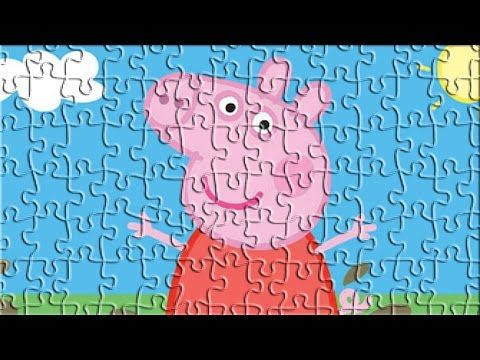

# PUZZLE DORA

Puzzle **DORA** est un jeu de puzzle fait en *javascript* qui consiste simplement à reconstituer une image en déplaçant les cases. Naviguer librement entre les niveaux et les images en écoutant de la bonne musique pour vous relaxer.
## Comment jouer
Télécharger la source en faisant un :

    git clone https://github.com/ljoboy/puzzle

> Ou en cliquant sur le bouton *clone or download* puis sur *download
> zip*

puis lancer le fichier **index.html**
Made with love by [LJOBOY](https://www.github.com/ljoboy)